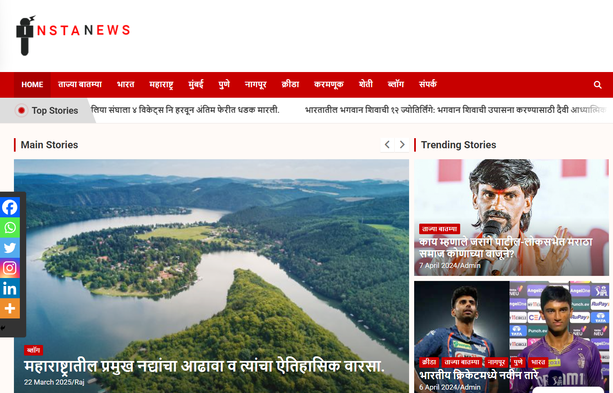

# InstaNews Marathi News Portal

[Visit Us](https://instanews.press)

### 🏢 About the Client

InstaNews is a Marathi news portal that intends to provide fresh and current news in the Marathi language. The website attempts to address an increasing demand for local-language news content, covering news of regional, national, and global events, entertainment, politics, sports, and others.

### 📚  Overview

The project entailed developing a complete working Marathi news website that delivers users the latest news in an easily accessible format. The site was to be coded using PHP, MySQL, WordPress, WooCommerce, Elementor, and the Astra theme.

### 🧑🏻‍💻 Technology Stack

- **PHP:** For custom backend and server-side logic.
- **MySQL:** For data storage and retrieval management, in order to ensure quick and consistent access to articles, user accounts, and other important website data.
- **WordPress:** The CMS (Content Management System) that powers the site, making it easier for the client to update and manage content.
- **WooCommerce:** Built-in for any e-commerce functionality, including subscription-based models or online merchandise sales.
- **Elementor:** A WordPress page builder plugin for custom design layouts, providing a visually sound user experience.
- **Astra Theme:** A super customizable, lightweight WordPress theme, providing a fast and responsive web design.
- **Marathi Language Support:** Ensuring that all content on the website was available in the Marathi language, for a local audience.

### 🎯 Objectives

- **Construct a User-Friendly Website:** Create an easy-to-use interface that enables users to find their way through news articles and sections with ease.
- **Multilingual Support:** Provide a Marathi-language version of the website, for the local audience.
- **Fast Load Times:** Make the website load fast, providing a seamless user experience, even on mobile phones.
- **Responsive Design:** Make the website as responsive as possible so that it has an optimal view on all devices (desktop, tablet, and mobile).
- **E-commerce Integration:** Integrate monetization avenues, such as sales of merchandise or a subscription-based model to premium content.
- **SEO Optimization:** Use tactics to make the website rank high in search engines with keywords that are relevant.

### 🚧  Challenges

- **Language Integration:** Seamless integration of the Marathi language was one of the primary challenges, ensuring proper character rendering and simple content management in Marathi. Customizations to the WordPress platform were necessary, as well as ensuring plugin compatibility.
- **Performance:** With the load of updates of news in real-time, while the website speed must remain fast. The site must handle a lot of traffic at peak times, such as when breaking news happens.
- **Content Organization:** A news website needs dynamic content organization, various categories, tags, and sections (e.g., local news, entertainment, politics, etc.). The problem was to organize the backend to allow for simple publishing of articles and categorization.
- **Mobile Optimization:** Since most users would be likely to view the website from mobile devices, providing a mobile-optimized experience was essential. This meant optimizing the responsive design and testing across various screen sizes.

### 💡Solution

- **Custom Development:** PHP code was customized to cater to specific functionality requirements, such as integration with MySQL databases for effective content management and rapid retrieval of articles.
- **WordPress & Elementor:** Employing WordPress as the CMS made it simple to manage content by the client. Elementor was employed for developing aesthetically pleasing, customizable pages without writing custom HTML/CSS.
- **Marathi Language Support:** The website was coded with complete Marathi-language support. Custom font and text rendering were used to ensure a proper reading experience. We also included a plugin for effortless translation of the content.
- **E-Commerce Integration:** WooCommerce was integrated on the website to enable possible e-commerce features like paid subscriptions and merchandise sales. A payment gateway was installed to enable effortless transactions.
- **SEO Optimization:** An SEO strategy was followed, which included on-page SEO, schema markup on news articles, and Google News feed integration for enhanced visibility.
- **Performance Optimization:** The site was optimized for performance with the help of caching plugins, a Content Delivery Network (CDN), and image compression methods. This made the site load fast even during traffic peaks.

### 📈 Results  

- **User Engagement:** Following the launch, the website experienced increased local traffic, with users appreciating the simplicity of the navigation and the fact that the content is presented in Marathi.
- **Mobile Optimization Success:** The mobile website experienced a considerable boost in traffic, verifying that the responsive design was effective.
- **E-commerce Revenue:** Through WooCommerce integration, InstaNews experienced early success in revenue generation through premium subscriptions and the sale of related merchandise.
- **Improved SEO Rankings:** The application of SEO tactics resulted in the website's improved position in search engine listings, particularly for local Marathi news terms.
- **Client Satisfaction:** The client was satisfied with the end product, with the site fulfilling all their objectives and expectations. They were especially happy with the simplicity of content management in Marathi.
